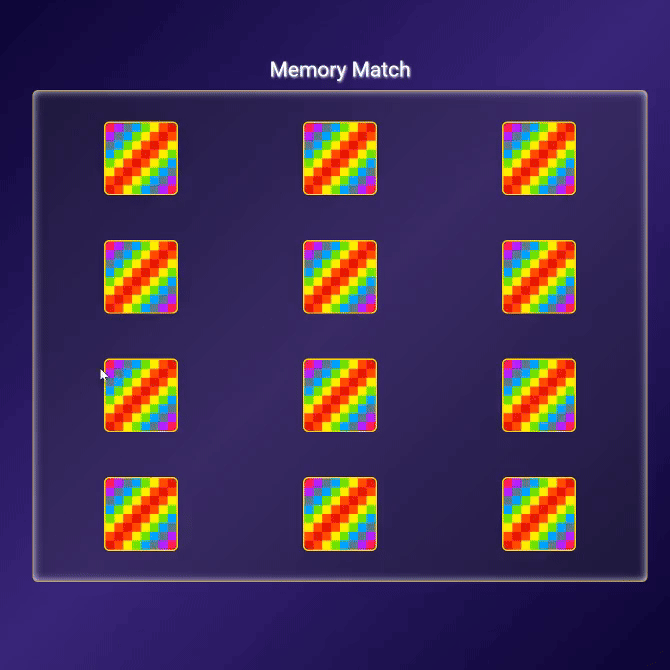

# Memory Match Game

A browser-based interactive card matching game designed to test memory and concentration. Built with vanilla JavaScript, featuring smooth 3D animations and dynamic grid generation.

## 🔗 Links

- **Live Demo Link:** https://e3prime.github.io/memory_match

## 🎮 Gameplay Showcase

_Watch the card flipping and matching logic in action!_

## 🧐 About The Project

This project is a logic-focused web application. The goal is simple: find all matching pairs of cards. It demonstrates how to manage complex game state (locked board, first card flipped, second card flipped) without relying on external game engines or frameworks.

### Key Features

- **Dynamic Shuffling:** utilizes a custom shuffling algorithm (Fisher-Yates logic) to ensure the card arrangement is randomized and unique every time the game creates a new board.
- **3D Card Animations:** smooth CSS transforms and transitions create a realistic "flip" effect when cards are clicked.
- **Visual Feedback:**
  - **Match:** Cards lock or slightly rotate sideways back and forth into place visually indicating success.
  - **No Match:** Cards shake or pause briefly before flipping back over, allowing the user to memorize positions.
- **Scalable Architecture:** The codebase is designed with extensibility in mind. The card data is decoupled from the DOM generation, making it effortless to add new card themes or increase the difficulty by adding more pairs.

## 🛠️ Technologies Used

- **HTML** for the game board structure.
- **CSS** for the grid layout, perspective styling, and 3D flip animations.
- **JavaScript (ES6+)** for the game logic, event listeners, and DOM manipulation.
